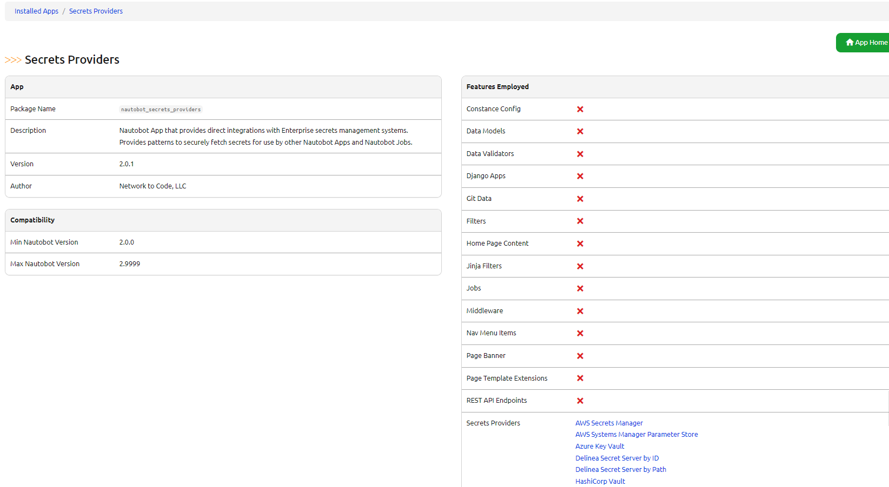
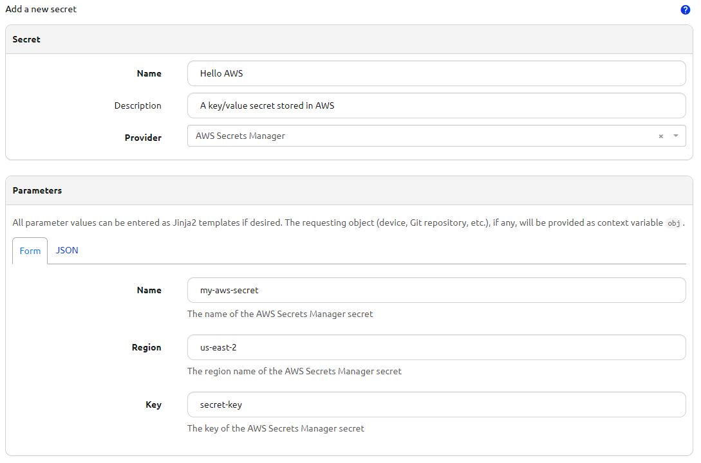
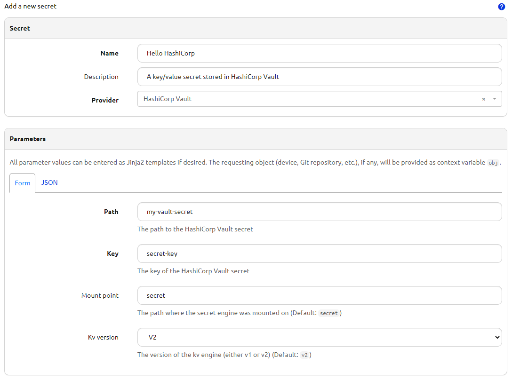
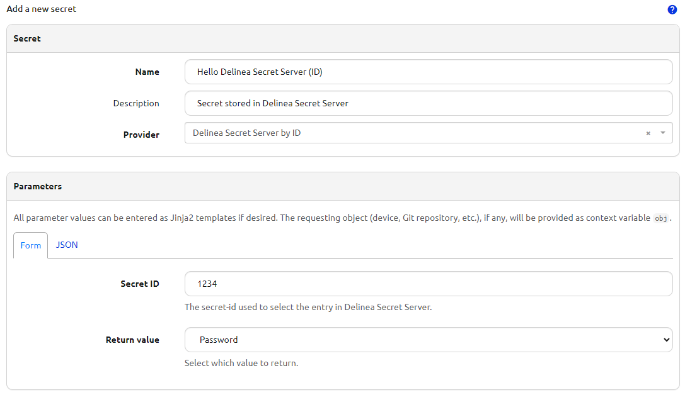
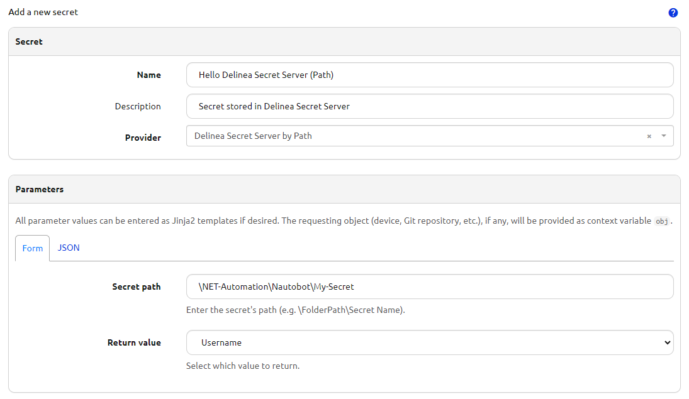
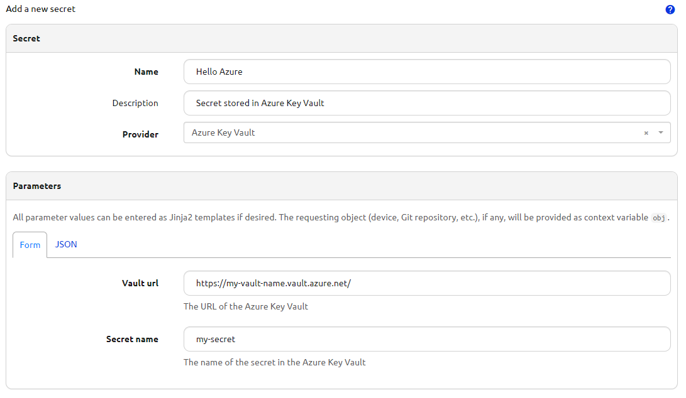

# Using the App

This document describes common use-cases and scenarios for this App.

## General Usage

## Use-cases and common workflows

## Screenshots

---

---

---

---

---

---

---

---

