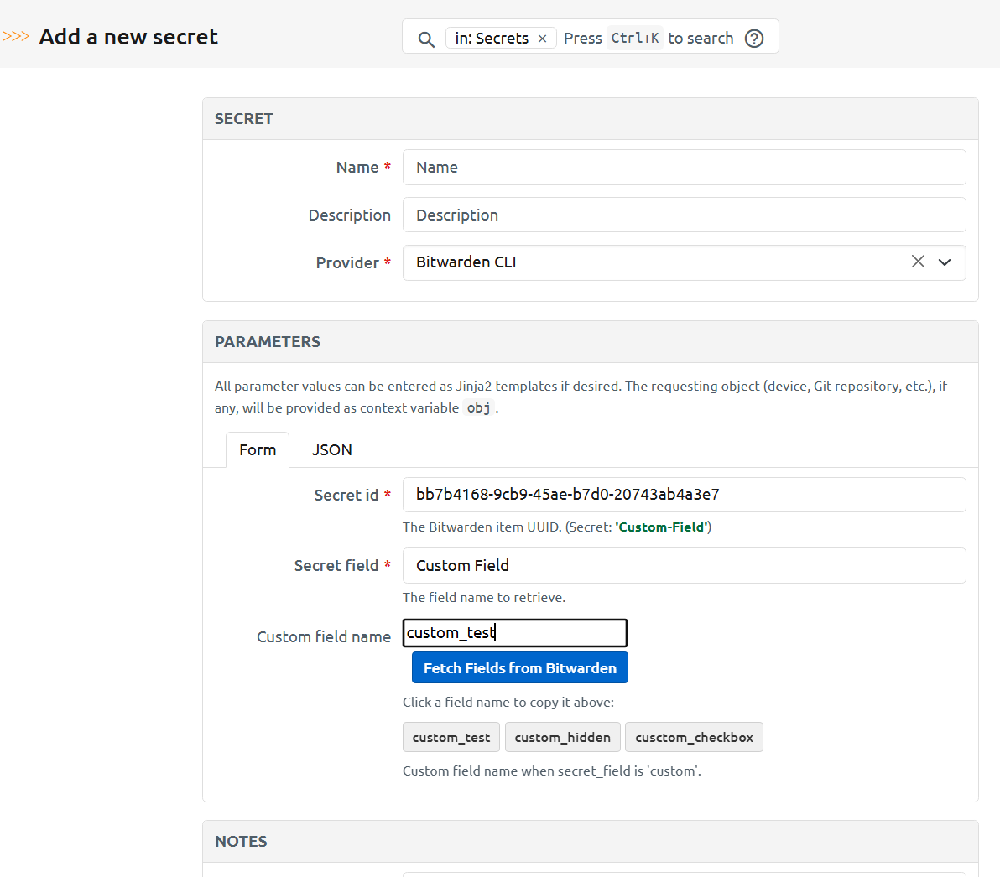
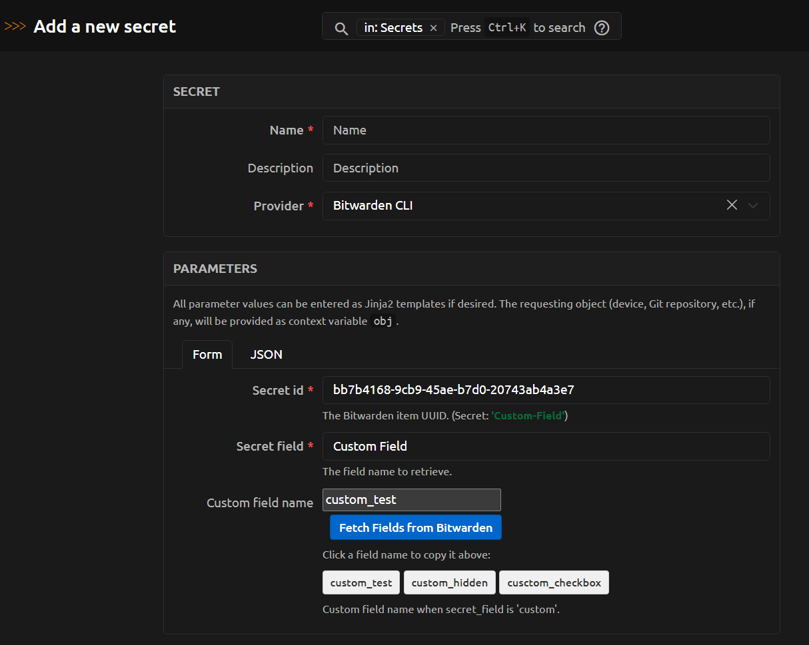

# Using the App

This document describes common use-cases and scenarios for this App.

## General Usage

## Use-cases and common workflows

## Screenshots

{ .on-glb }
{ .on-glb }

---

{ .on-glb }
{ .on-glb }

---

{ .on-glb }
{ .on-glb }

---

{ .on-glb }
{ .on-glb }

---

{ .on-glb }
{ .on-glb }

---

{ .on-glb }
{ .on-glb }

---

---

## Bitwarden CLI — Form Helpers

The Bitwarden CLI provider form includes interactive helpers for Secret configuration.

### Find Item UUID

On Secret create and edit forms, click **Find Item UUID** (below the Secret ID field) to open a search panel. Enter at least two
characters and press Enter or click **Search** to find Bitwarden items by name. Select a result by
pressing Enter or double-clicking to copy the UUID into the Secret ID field. The panel closes after
selection.

All lookups go through Nautobot's internal API; the browser does not contact the Bitwarden CLI
directly. The helper endpoints require the `extras.view_secret` permission.

When an item resolves, the Secret **description** field is populated with the Bitwarden item name if
it is currently empty. If the description already matches the previously resolved item name, it is
replaced with the new name.

### Custom Field Name Selection

Once a Secret ID is set, the form automatically retrieves item metadata and initializes the
**Custom Field Name** dropdown from the referenced Bitwarden item.

The form also resolves the item name and filters the **Secret Field** dropdown to show only options
relevant to the item type (for example, Card fields for Card items only).

When an edit form already contains a Secret ID, this lookup and type-based filtering run during page
initialization.

If the edit form already contains a stored **Custom Field Name**, that value remains selected during
initialization so it is not cleared before metadata loading completes.

If **Secret Field** is set to **Custom Field**, selecting a **Custom Field Name** value is required before
the form can be saved.
The validation message shown is:
*"Custom field name is required if Secret field is set to 'Custom Field'."*
Invalid values are blocked and are not saved to Secret `parameters`.

When **Secret Field** is changed away from **Custom Field**, **Custom Field Name** is reset to an
empty selection.

On the Secret detail page, the **Find Item UUID** and **Search** buttons are hidden. Helper field
values are not persisted into Secret `parameters`.

---

{ .on-glb }
{ .on-glb }

---

{ .on-glb }
{ .on-glb }

---

{ .on-glb }
{ .on-glb }
